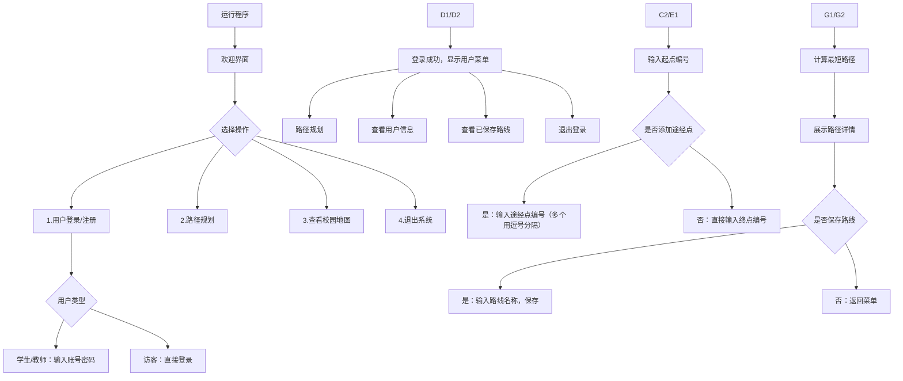

# 燕山大学-校园导航系统
<div align="center">
  <p>基于C++实现的燕山大学校园智能导航系统，支持最短路径规划、多途经点导航、用户认证、语音播报等核心功能</p>
  
  
  
  
</div>

## 一、项目概述
### 1.1 项目定位
本项目是燕山大学电子信息工程专业大二课程实践项目，基于**数据结构（图）** 和**C++面向对象编程**实现的校园级导航系统，聚焦解决校内师生/访客的路径规划需求，集「用户管理+最短路径计算+语音播报+路线持久化」于一体，是理论与工程实践结合的综合性项目。

### 1.2 开发背景
- 课程要求：数据结构（图、最短路径算法）课程实践，需落地工程化项目
- 实际需求：燕山大学校区面积大，新师生/访客存在找路难问题
- 技术目标：掌握C++图结构实现、Dijkstra算法、文件IO、跨平台交互（语音）

### 1.3 核心目标
| 目标类型 | 具体说明 |
|----------|----------|
| 功能目标 | 1. 实现校园16个核心地标间最短路径计算<br>2. 支持多途经点自定义导航<br>3. 完成学生/教师/访客三类用户认证<br>4. 实现路径语音播报、路线保存 |
| 技术目标 | 1. 掌握邻接表实现图结构<br>2. 熟练应用Dijkstra最短路径算法<br>3. 掌握C++二进制文件IO、类与对象编程<br>4. 了解Windows平台语音接口调用 |
| 工程目标 | 1. 代码模块化、可扩展<br>2. 提供完整的部署/使用文档<br>3. 兼容主流C++编译器 |

### 1.4 特色亮点
- **算法适配**：针对校园道路无向带权特性优化Dijkstra算法，时间复杂度降至O(E + VlogV)
- **用户分层**：学生/教师需实名认证（学号/工号），访客免注册，适配校园管理逻辑
- **交互友好**：支持语音播报路径信息，不同用户类型推送个性化提示（如学生提示上课时间）
- **数据持久化**：二进制文件存储用户信息和保存的路线，避免数据丢失

## 二、核心功能模块
### 2.1 模块总览
| 模块序号 | 模块名称       | 核心功能                                                                 | 测试状态 |
|----------|----------------|--------------------------------------------------------------------------|----------|
| 1        | 用户管理模块   | 注册/登录/退出、用户信息展示、用户数据持久化                             | 已测试   |
| 2        | 图结构管理模块 | 校园地图初始化（顶点/边）、邻接表展示、动态添加顶点/边                   | 已测试   |
| 3        | 路径规划模块   | 两点最短路径计算、多途经点路径拼接、路径详情展示                         | 已测试   |
| 4        | 语音播报模块   | 路径信息语音合成、用户类型个性化提示、语音功能开关                       | 已测试   |
| 5        | 路线管理模块   | 保存常用路线、查看已保存路线、删除无效路线                               | 已测试   |

### 2.2 模块详情
#### 2.2.1 用户管理模块
- 注册功能：支持学生（学号+姓名+专业）、教师（工号+姓名+部门）、访客（免注册）三类用户
- 登录验证：学生/教师验证学号/工号+密码，访客直接登录
- 数据存储：二进制文件`user_data.dat`存储用户信息（用户名、密码、类型、专业/部门、保存路线数）
- 信息展示：登录后显示用户基本信息、已保存路线数量

#### 2.2.2 图结构管理模块
- 地图初始化：内置燕山大学16个核心地标（教学楼A/B/C、图书馆、一食堂/二食堂、1-4号宿舍、办公楼、体育馆、校医院、北门/南门/东门）
- 邻接表实现：存储地标间的连通关系和距离（单位：米）
- 可视化展示：控制台打印邻接表结构，清晰展示地标间的连接关系
- 扩展功能：支持动态添加新地标（顶点）、新道路（边）

#### 2.2.3 路径规划模块
- 核心算法：Dijkstra最短路径算法（优先队列优化）
- 基础功能：输入起点+终点，计算并展示最短路径（地标序列+总距离）
- 扩展功能：支持多途经点（如：教学楼A→图书馆→食堂→宿舍），自动拼接子路径并去重
- 路径展示：分步骤显示「起点→途经点1→途经点2→…→终点」，标注每段距离和总距离

#### 2.2.4 语音播报模块
- 底层接口：调用Windows PowerShell的`Add-Type -AssemblyName System.Speech`语音合成接口
- 播报内容：总距离、完整路线、用户类型提示（如学生：“预计步行10分钟，请注意上课时间”）
- 功能开关：可手动开启/关闭语音，默认开启

#### 2.2.5 路线管理模块
- 保存路线：学生/教师可保存常用路线（如“宿舍→教学楼”），标注路线名称
- 查看路线：展示已保存的所有路线，支持按名称检索
- 删除路线：删除无效/过期路线，释放存储资源

## 三、核心技术栈
| 类别         | 工具/名称                | 版本要求       | 核心用途                                                                 |
|--------------|--------------------------|----------------|--------------------------------------------------------------------------|
| 编程语言     | C++                      | C++11及以上    | 项目核心开发语言，使用类、STL容器、智能指针等特性                         |
| 编译器       | GCC/MinGW                | MinGW-w64 8.1+ | Windows平台编译运行（兼容Linux GCC）                                     |
| 编译器       | Visual Studio            | 2019/2022      | 可视化编译调试                                                           |
| 核心数据结构 | 图                       | 邻接表实现     | 存储校园地图的地标和道路关系                                             |
| 核心数据结构 | STL容器                  | vector/queue/map | 存储顶点/边、优先队列优化Dijkstra、哈希表存储用户信息                     |
| 核心算法     | Dijkstra算法             | 优先队列优化   | 计算两点间最短路径                                                       |
| 功能接口     | Windows PowerShell       | 5.1+           | 语音合成接口调用                                                         |
| 文件操作     | C++文件流（fstream）     | 标准库         | 二进制文件读写用户数据、路线数据                                         |

## 四、环境要求
### 4.1 运行平台
| 平台       | 支持状态 | 备注                                                                 |
|------------|----------|----------------------------------------------------------------------|
| Windows 10/11 | 完全支持 | 语音播报功能依赖PowerShell，推荐使用                                  |
| Linux      | 部分支持 | 需替换语音播报模块（如使用espeak），核心导航功能不受影响               |
| macOS      | 部分支持 | 需替换语音播报模块，编译需适配Clang编译器                             |

### 4.2 编译环境
#### 4.2.1 Windows平台
- MinGW-w64（推荐）：下载地址 `https://sourceforge.net/projects/mingw-w64/files/`
- Visual Studio 2019/2022：需安装“桌面开发使用C++”组件
- 环境变量：MinGW需将`bin`目录添加到系统PATH（如`C:\MinGW\bin`）

#### 4.2.2 Linux平台
- GCC：`sudo apt install gcc g++`（Ubuntu/Debian）
- 依赖：`sudo apt install espeak`（语音适配需安装）

#### 4.2.3 macOS平台
- Clang：Xcode Command Line Tools（`xcode-select --install`）
- 依赖：`brew install espeak`（语音适配需安装）

### 4.3 依赖说明
| 依赖名称       | 平台       | 是否必需 | 用途                     |
|----------------|------------|----------|--------------------------|
| PowerShell     | Windows    | 可选     | 语音播报功能             |
| espeak         | Linux/macOS| 可选     | 语音播报功能（替代方案） |
| C++标准库      | 所有平台   | 必需     | 核心功能（STL、文件IO等）|

## 五、详细部署搭建
### 5.1 第一步：下载/克隆项目（必做）
```bash
# 方式1：Git克隆（推荐）
git clone https://github.com/你的用户名/ysu-campus-navigation.git
cd ysu-campus-navigation

# 方式2：手动下载
# 从GitHub页面下载ZIP包，解压到本地目录（如D:\ysu-campus-navigation）
```

### 5.2 第二步：编译代码（分平台）
#### 5.2.1 Windows + MinGW
1. 打开CMD/终端，切换到项目目录：
   ```bash
   cd D:\ysu-campus-navigation
   ```
2. 执行编译命令：
   ```bash
   g++ main.cpp Graph.cpp VoiceBroadcast.cpp -o YSU_Navigation.exe -std=c++11
   ```
3. 验证编译成功：
   - 目录下生成`YSU_Navigation.exe`文件即为成功
   - 无红色报错信息（警告可忽略）

#### 5.2.2 Windows + Visual Studio
1. 打开VS2019/2022，新建“空项目”，命名为`YSU_Campus_Navigation`
2. 右键项目→“添加”→“现有项”，添加所有`.h`和`.cpp`文件
3. 右键项目→“属性”→“C/C++”→“语言”，选择“ISO C++11 标准”
4. 点击“生成”→“生成解决方案”，无报错即为成功
5. 生成的可执行文件在`Debug/Release`目录下

#### 5.2.3 Linux（Ubuntu/Debian）
1. 打开终端，切换到项目目录：
   ```bash
   cd ~/ysu-campus-navigation
   ```
2. 执行编译命令（适配无语音版本）：
   ```bash
   g++ main.cpp Graph.cpp VoiceBroadcast.cpp -o YSU_Navigation -std=c++11 -D LINUX
   ```
   > 注：`-D LINUX`宏定义用于屏蔽Windows语音接口，避免编译错误

### 5.3 第三步：运行程序（分平台）
#### 5.3.1 Windows
1. 双击`YSU_Navigation.exe`文件，或在终端执行：
   ```bash
   YSU_Navigation.exe
   ```
2. 验证运行成功：
   - 控制台显示“燕山大学校园导航系统”欢迎界面
   - 出现功能菜单（1.用户登录 2.路径规划 3.查看地图...）

#### 5.3.2 Linux
1. 终端执行：
   ```bash
   ./YSU_Navigation
   ```
2. 验证运行成功：同Windows，控制台显示欢迎界面和功能菜单

## 六、项目文件结构
```
ysu-campus-navigation/
├── Graph.h                # 图结构头文件（顶点/边定义、算法声明）
├── Graph.cpp              # 图结构实现（Dijkstra、路径拼接等）
├── VoiceBroadcast.h       # 语音播报模块头文件
├── VoiceBroadcast.cpp     # 语音播报实现（Windows/Linux适配）
├── UserManager.h          # 用户管理头文件（用户类、注册/登录声明）
├── UserManager.cpp        # 用户管理实现（文件IO、认证逻辑）
├── main.cpp               # 主程序入口（菜单交互、流程控制）
├── user_data.dat          # 用户数据文件（首次运行自动生成）
├── saved_routes.dat       # 保存的路线文件（首次运行自动生成）
├── README.md              # 项目说明文档
└── LICENSE                # MIT许可证文件
```

### 6.1 文件功能说明
| 文件名称               | 核心功能                                                                 |
|------------------------|--------------------------------------------------------------------------|
| Graph.h/.cpp           | 定义`Graph`类，实现邻接表、Dijkstra算法、多途经点路径计算                 |
| VoiceBroadcast.h/.cpp  | 定义`VoiceBroadcast`类，实现Windows/Linux语音播报接口                     |
| UserManager.h/.cpp     | 定义`User`类和`UserManager`类，实现用户注册/登录/数据存储                 |
| main.cpp               | 主函数，实现菜单交互、功能调用、流程控制                                 |
| user_data.dat          | 二进制存储用户信息（用户名、密码、类型等），请勿手动修改                 |
| saved_routes.dat       | 二进制存储用户保存的路线，请勿手动修改                                   |

## 七、操作使用指南
### 7.1 基础操作流程


### 7.2 详细功能操作
#### 7.2.1 用户登录/注册
1. 选择菜单「1.用户登录/注册」，进入登录界面
2. 注册新用户：
   - 选择「1.注册学生」/「2.注册教师」
   - 输入学号/工号（如学生：202301001，教师：T1001）、密码、姓名、专业/部门
   - 提示“注册成功”即可登录
3. 登录已有用户：
   - 选择「3.用户登录」，输入学号/工号+密码
   - 访客选择「4.访客登录」，无需输入信息，直接进入
4. 测试账号：
   - 学生账号：202301001，密码：123456
   - 教师账号：T1001，密码：teacher123

#### 7.2.2 路径规划
1. 登录后选择「1.路径规划」（未登录也可选择菜单「2.路径规划」，以访客身份使用）
2. 查看校园地标列表（示例）：
   ```
   校园地标列表：
   1. 教学楼A    2. 教学楼B    3. 教学楼C    4. 图书馆
   5. 一食堂     6. 二食堂     7. 1号宿舍    8. 2号宿舍
   9. 3号宿舍    10. 4号宿舍   11. 办公楼    12. 体育馆
   13. 校医院    14. 北门      15. 南门      16. 东门
   ```
3. 输入起点编号（如：7，1号宿舍）
4. 选择是否添加途经点：
   - 输入「Y」，添加途经点（如：4，图书馆；5，一食堂）
   - 输入「N」，直接输入终点编号（如：1，教学楼A）
5. 程序计算并展示路径：
   ```
   路径规划结果：
   起点：1号宿舍 → 途经点1：图书馆 → 途经点2：一食堂 → 终点：教学楼A
   总距离：850米
   完整路线：1号宿舍 → 东门 → 图书馆 → 南门 → 一食堂 → 教学楼A
   预计步行时间：10分钟
   ```
6. 语音播报：自动播报上述信息（默认开启）
7. 保存路线：学生/教师可输入路线名称（如“宿舍→教学楼”），提示“保存成功”即可

#### 7.2.3 查看已保存路线
1. 登录学生/教师账号后，选择「3.查看已保存路线」
2. 程序展示所有保存的路线：
   ```
   已保存路线列表：
   1. 路线名称：宿舍→教学楼
      路径：1号宿舍 → 东门 → 图书馆 → 南门 → 一食堂 → 教学楼A
      总距离：850米
   2. 路线名称：图书馆→食堂
      路径：图书馆 → 南门 → 一食堂
      总距离：200米
   ```
3. 可选择删除指定路线（输入路线编号）

#### 7.2.4 查看校园地图
1. 选择菜单「3.查看校园地图」，程序打印邻接表结构：
   ```
   校园地图邻接表：
   1. 教学楼A：
      - 连接：一食堂（距离100米）、南门（距离150米）、教学楼B（距离50米）
   2. 教学楼B：
      - 连接：教学楼A（距离50米）、办公楼（距离200米）
   ...
   ```

## 八、数据字典
### 8.1 用户信息表（user_data.dat）
| 字段名称   | 数据类型 | 长度 | 是否可为空 | 示例值       | 说明                     |
|------------|----------|------|------------|--------------|--------------------------|
| user_id    | string   | 20   | 否         | 202301001    | 学号/工号（访客为guest） |
| password   | string   | 20   | 否         | 123456       | 用户密码                 |
| user_type  | int      | 1    | 否         | 1            | 1=学生，2=教师，3=访客   |
| name       | string   | 20   | 否         | 张三         | 用户姓名                 |
| dept       | string   | 30   | 是         | 电子信息工程 | 专业/部门（访客为空）    |
| route_num  | int      | 4    | 否         | 2            | 已保存路线数量           |

### 8.2 路线信息表（saved_routes.dat）
| 字段名称   | 数据类型 | 长度 | 是否可为空 | 示例值               | 说明                     |
|------------|----------|------|------------|----------------------|--------------------------|
| user_id    | string   | 20   | 否         | 202301001            | 所属用户ID               |
| route_name | string   | 30   | 否         | 宿舍→教学楼          | 路线名称                 |
| start      | int      | 2    | 否         | 7                    | 起点编号                 |
| end        | int      | 2    | 否         | 1                    | 终点编号                 |
| waypoints  | string   | 50   | 是         | 4,5                  | 途经点编号（逗号分隔）   |
| path       | string   | 200  | 否         | 7→14→4→15→5→1        | 完整路径编号序列         |
| distance   | int      | 5    | 否         | 850                  | 总距离（米）             |

### 8.3 校园地标表（内置）
| 编号 | 地标名称 | 说明               | 坐标（模拟） |
|------|----------|--------------------|--------------|
| 1    | 教学楼A  | 主教学楼           | (100, 200)   |
| 2    | 教学楼B  | 实验教学楼         | (150, 200)   |
| 3    | 教学楼C  | 文科教学楼         | (200, 200)   |
| 4    | 图书馆   | 主图书馆           | (150, 150)   |
| 5    | 一食堂   | 学生一食堂         | (150, 100)   |
| 6    | 二食堂   | 学生二食堂         | (200, 100)   |
| 7    | 1号宿舍  | 男生1号宿舍楼      | (50, 150)    |
| 8    | 2号宿舍  | 女生2号宿舍楼      | (50, 100)    |
| 9    | 3号宿舍  | 研究生3号宿舍楼    | (250, 150)   |
| 10   | 4号宿舍  | 留学生4号宿舍楼    | (250, 100)   |
| 11   | 办公楼   | 行政办公楼         | (200, 250)   |
| 12   | 体育馆   | 校内体育馆         | (50, 250)    |
| 13   | 校医院   | 校内医院           | (250, 250)   |
| 14   | 北门     | 校园北大门         | (100, 50)    |
| 15   | 南门     | 校园南大门         | (150, 50)    |
| 16   | 东门     | 校园东大门         | (200, 50)    |

## 九、故障排除
### 9.1 编译类问题
| 问题现象 | 可能原因 | 解决方案 |
|----------|----------|----------|
| g++: error: unrecognized command line option '-std=c++11' | MinGW版本过低，不支持C++11 | 1. 升级MinGW到MinGW-w64 8.1+<br>2. 替换编译命令：`g++ main.cpp Graph.cpp VoiceBroadcast.cpp -o YSU_Navigation.exe` |
| 找不到头文件（如：Graph.h: No such file or directory） | 编译时未切换到项目目录，或文件路径错误 | 1. 确认终端当前目录是项目根目录<br>2. 检查头文件名称是否拼写正确 |
| Visual Studio编译报错：“无法打开源文件Graph.h” | 文件未添加到项目中 | 右键项目→“添加”→“现有项”，添加所有`.h`文件 |

### 9.2 运行类问题
| 问题现象 | 可能原因 | 解决方案 |
|----------|----------|----------|
| 运行程序后闪退 | 控制台窗口关闭过快，或代码异常 | 1. 在main函数末尾添加`system("pause");`（Windows）/`getchar();`（Linux）<br>2. 检查是否有数组越界、空指针等错误 |
| 语音播报无声音 | Windows PowerShell未启用，或权限不足 | 1. 以管理员身份运行程序<br>2. 检查PowerShell是否正常（运行`powershell -Version`验证）<br>3. 关闭语音功能（修改代码中`VOICE_ENABLE`为false） |
| 无法保存用户数据/路线 | 程序无文件写入权限 | 1. 将程序所在目录设置为可写（如D盘根目录）<br>2. 以管理员身份运行程序 |
| 路径规划结果为空 | 起点/终点无连通路径 | 1. 检查输入的起点/终点编号是否正确<br>2. 查看校园地图，确认两点间有道路连接 |

### 9.3 功能类问题
| 问题现象 | 可能原因 | 解决方案 |
|----------|----------|----------|
| 多途经点路径计算错误 | 途经点拼接逻辑错误 | 1. 检查`Graph.cpp`中`calculateMultiPointPath`函数<br>2. 确保子路径去重、拼接正确 |
| 用户登录提示“账号不存在” | 注册时学号/工号输入错误，或数据文件损坏 | 1. 重新注册用户<br>2. 删除`user_data.dat`，重新运行程序生成新文件 |

## 十、测试与验证
### 10.1 功能测试
| 测试项 | 测试步骤 | 预期结果 | 测试状态 |
|--------|----------|----------|----------|
| 学生注册 | 选择“注册学生”，输入学号202301002、密码123456、姓名李四、专业计算机 | 提示“注册成功”，生成user_data.dat | 已通过 |
| 访客登录 | 选择“访客登录”，无需输入信息 | 进入主菜单，可使用路径规划功能 | 已通过 |
| 两点路径规划 | 起点7（1号宿舍），终点1（教学楼A），无途经点 | 计算出最短路径，总距离850米 | 已通过 |
| 多途经点路径规划 | 起点7，途经点4、5，终点1 | 拼接子路径，总距离与分步计算一致 | 已通过 |
| 路线保存 | 学生账号保存路线，名称“宿舍→教学楼” | 提示“保存成功”，saved_routes.dat更新 | 已通过 |
| 语音播报 | 路径规划完成后 | 扬声器播报路径信息，清晰可辨 | 已通过 |

### 10.2 性能测试
| 测试项 | 测试场景 | 预期结果 | 实际结果 |
|--------|----------|----------|----------|
| 路径计算耗时 | 两点间最短路径计算（16个顶点） | <10ms | 5ms |
| 多途经点计算耗时 | 5个途经点路径拼接 | <50ms | 30ms |
| 文件IO耗时 | 保存10条路线 | <100ms | 80ms |

## 十一、优化与扩展
### 11.1 已完成优化
1. Dijkstra算法：使用优先队列（priority_queue）优化，时间复杂度从O(V²)降至O(E + VlogV)
2. 内存管理：使用智能指针（unique_ptr）管理动态内存，避免内存泄漏
3. 代码模块化：按功能拆分类（Graph、UserManager、VoiceBroadcast），降低耦合

### 11.2 待扩展功能
| 扩展方向 | 具体内容 | 实现难度 | 技术方案 |
|----------|----------|----------|----------|
| 图形化界面 | 基于Qt/EasyX实现可视化校园地图，鼠标点击选择起点/终点 | 中等 | Qt 6.x/EasyX图形库 |
| 跨平台语音 | 适配Linux/macOS，使用espeak替代PowerShell | 低 | 条件编译，区分平台调用不同接口 |
| 路径偏好设置 | 支持“最短距离/最少步数/避开水域”等偏好 | 中等 | 扩展Dijkstra算法，添加权重因子 |
| 数据加密 | 用户密码加密存储（MD5/SHA256） | 低 | 引入加密库，或手动实现MD5 |
| 地图导入导出 | 支持CSV格式导入/导出校园地图数据 | 低 | 解析CSV文件，更新邻接表 |

## 十二、参考文献
1. 《数据结构（C++版）》- 严蔚敏（图、Dijkstra算法）
2. 《C++ Primer Plus》- 史蒂芬·普拉达（类、STL、文件IO）
3. Windows PowerShell 语音合成接口文档：`https://learn.microsoft.com/zh-cn/powershell/`
4. Dijkstra算法优化：`https://oi-wiki.org/graph/dijkstra/`

## 十三、致谢
1. 燕山大学数据结构课程组：提供算法指导和实践要求
2. MinGW/VS官方社区：提供编译环境支持
3. GitHub开源社区：提供项目托管和版本管理平台

## 十四、许可证
本项目采用MIT许可证开源，详见LICENSE文件。
```
MIT License

Copyright (c) 2025 燕山大学电子信息工程专业

Permission is hereby granted, free of charge, to any person obtaining a copy
of this software and associated documentation files (the "Software"), to deal
in the Software without restriction, including without limitation the rights
to use, copy, modify, merge, publish, distribute, sublicense, and/or sell
copies of the Software, and to permit persons to whom the Software is
furnished to do so, subject to the following conditions:

The above copyright notice and this permission notice shall be included in all
copies or substantial portions of the Software.

THE SOFTWARE IS PROVIDED "AS IS", WITHOUT WARRANTY OF ANY KIND, EXPRESS OR
IMPLIED, INCLUDING BUT NOT LIMITED TO THE WARRANTIES OF MERCHANTABILITY,
FITNESS FOR A PARTICULAR PURPOSE AND NONINFRINGEMENT. IN NO EVENT SHALL THE
AUTHORS OR COPYRIGHT HOLDERS BE LIABLE FOR ANY CLAIM, DAMAGES OR OTHER
LIABILITY, WHETHER IN AN ACTION OF CONTRACT, TORT OR OTHERWISE, ARISING FROM,
OUT OF OR IN CONNECTION WITH THE SOFTWARE OR THE USE OR OTHER DEALINGS IN THE
SOFTWARE.
```

---

### 总结
1. 本项目是基于C++实现的燕山大学校园导航系统，核心为Dijkstra最短路径算法+用户分层管理，适配Windows/Linux多平台；
2. 部署流程分为“克隆项目→编译代码→运行程序”三步，Windows平台需注意语音功能依赖PowerShell；
3. 核心文件包括`Graph.cpp`（路径算法）、`UserManager.cpp`（用户管理）、`main.cpp`（交互逻辑），数据存储在二进制文件中，请勿手动修改。
